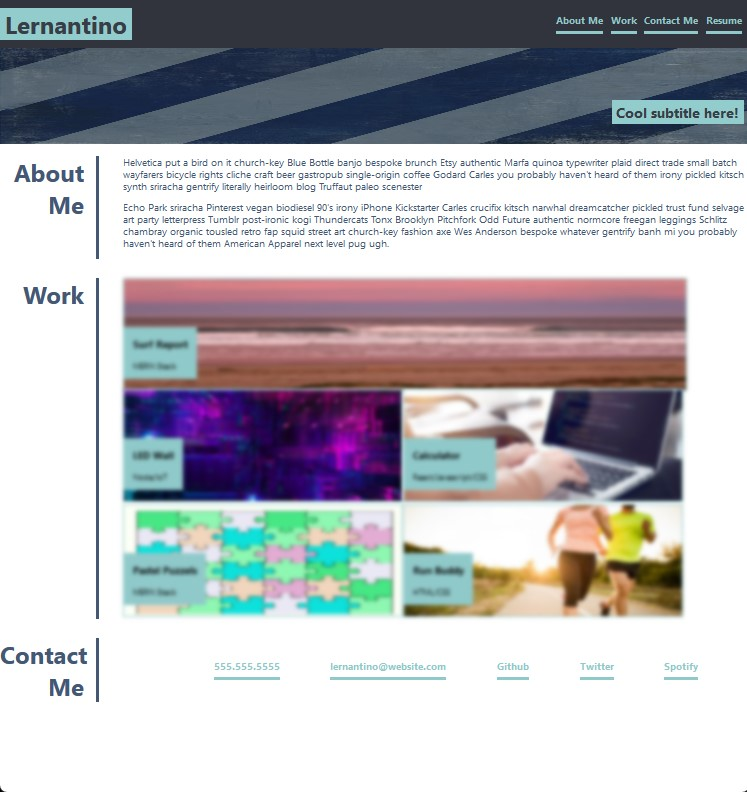

# portfolio-summary

<!-- PROJECT LOGO -->
 

  <h3 align="center">Portfolio Summary</h3>
 
  

    Challenge 2 on Portfolio Summary.

  

## Demo
 

  
Demo picture

(<a href="#readme-top">back to top</a>)

<!-- ABOUT THE PROJECT -->
## About The Project

### portfolio summary:
<li>Created html page
<li>Created CSS file to stylish the webpage
<li>Set webpage to be responsive to multiple screen size
<li>fixed links

(<a href="#readme-top">back to top</a>)

<!-- LICENSE -->
## License

Distributed under the MIT License. See `LICENSE.txt` for more information.

(<a href="#readme-top">back to top</a>)

<!-- CONTACT -->
## Contact

Lantao Zhang - lantaook@gmail.com

Project Link: [https://pppzlt.github.io/portfolio-summary/](https://pppzlt.github.io/portfolio-summary/)

(<a href="#readme-top">back to top</a>)

